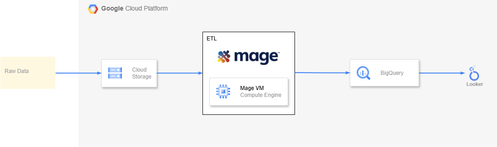
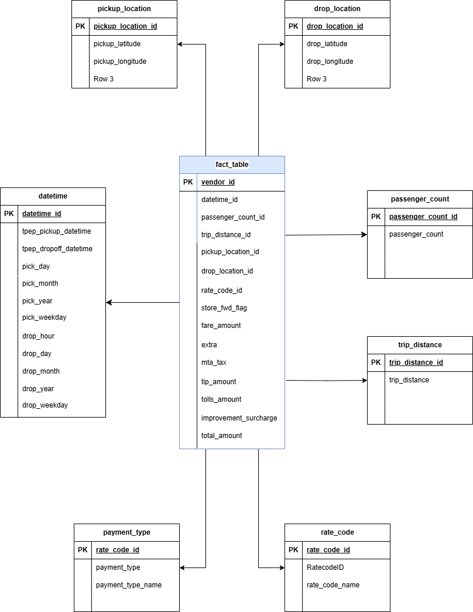

# Uber Data Pipeline on Google Cloud Platform

This project is about building a data pipeline to extract, transform and load Uber data from external data source over Google Cloud Storage to Google Cloud BigQuery, deployed by Mage and Google Cloud Compute Engine.

## Architecture

## Data Model

## Data Source

Website - https://www.nyc.gov/site/tlc/about/tlc-trip-record-data.page
Data Dictionary - https://www.nyc.gov/assets/tlc/downloads/pdf/data_dictionary_trip_records_yellow.pdf

## Tech Stack

1. Python
2. Mage
3. Google Cloud Platform
   a. Cloud Storage
   b. Compute Engine
   c. BigQuery
